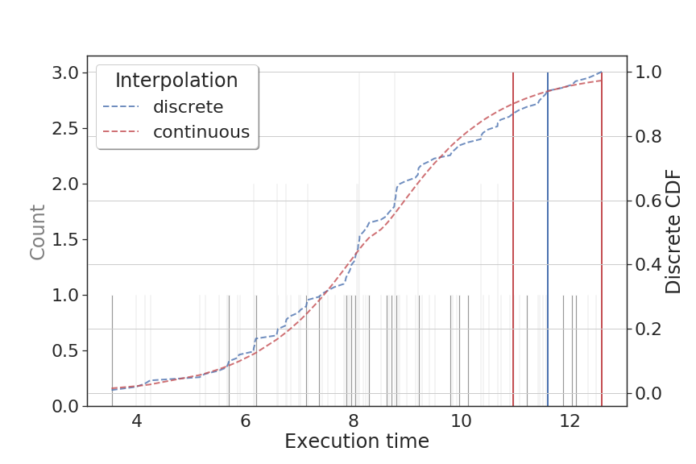

# HPC Walltime Request

Code for computing the optimal request time for a stochastic application when submitted on an HPC scheduler, based on historic information about previous runs. The theorem in the PDF below is used compute the sequence of requests: 

<object data="https://github.com/anagainaru/HPCWalltime/blob/master/docs/progdyn.pdf" type="application/pdf" width="700px" height="700px">
    <embed src="https://github.com/anagainaru/HPCWalltime/blob/master/docs/progdyn.pdf">
        <p><a href="https://github.com/anagainaru/HPCWalltime/blob/master/docs/progdyn.pdf">Download PDF</a></p>
    </embed>
</object>

## Papers

If you use the resources available here in your work, please cite our paper:

*Speculative Scheduling Techniques for Stochastic HPC Applications*. Ana Gainaru, Guillaume Pallez (Aupy), Hongyang Sun, Padma Raghavan [ICPP 2019] ([Link to the technical report](https://hal.inria.fr/hal-02158598/document))

```
@inproceedings{Gainaru:2019:SSS:3337821.3337890,
 author = {Gainaru, Ana and Aupy, Guillaume Pallez and Sun, Hongyang and Raghavan, Padma},
 title = {Speculative Scheduling for Stochastic HPC Applications},
 booktitle = {Proceedings of the 48th International Conference on Parallel Processing},
 series = {ICPP 2019},
 year = {2019},
 isbn = {978-1-4503-6295-5},
 location = {Kyoto, Japan},
 pages = {32:1--32:10},
 articleno = {32},
 numpages = {10},
 url = {http://doi.acm.org/10.1145/3337821.3337890},
 doi = {10.1145/3337821.3337890},
 acmid = {3337890},
 publisher = {ACM},
 address = {New York, NY, USA},
 keywords = {HPC runtime, Scheduling algorithm, stochastic applications},
} 
```

For details about why interpolation is needed when the historic information is low read our paper:
**Making Speculative Scheduling Robust to Incomplete Data**<br/>
Ana Gainaru, Guillaume Pallez. 
[SCALA@SC 2019] (Paper: [INRIA technical report](https://hal.inria.fr/hal-02158598/document))<br/>

## Usage

Any code wanting to use this code has to include:
- `import HPCRequest`

### 1. Prepare the data

Create a list with historic resource usage information. If walltime is the resource under study, `data` is a list of walltimes for past runs. Create a Workload object with the historic data (and optionally the interpolation method required)

```python
wf = HPCRequest.Workload(data)

wf_inter = HPCRequest.Workload(data, interpolation_model=HPCRequest.DistInterpolation)
```

If you wish to print the CDF of this data, the discrete data (e.g. unique walltimes) and the associated CDF values for each data can be extracted using the compute_cdf function:

```python3
optimal_data, optimal_cdf = wf.compute_cdf()
```


*Example discrete CDF and data (without using interpolation) - vertical blue lines represent the recommended request times*

### 2. Compute the sequence of requests

The `compute_sequence` function returns the recommended sequence of requests given a historic data. Optionally, the function takes the upper limit expected for the execution time of the application (if nothing is provided, the max(data) will be used as upper limit)

```python
sequence = wf.compute_sequence(max_value=100)
```
For large historic datasets, computing the distribution using the discrete data will give good results. Otherwise, interpolation is needed. 


*Example discrete vs interpolation CDF and sequences*


### 3. [Optional] Compute the cost of a sequence of requests for new data

Compute the cost of a given sequence by creating a Cost object based on the sequence and runing it on the new data. The cost represents the average time used by each submission for all reservations. This time represents all the failed reservation together with the sucessful one. For example, for two submissions one of 10 and another of 15 hours, the cost of the sequence [8, 11, 16] is the average between `8 + 10` (the first submission will fail when requesting 8hs and will succeed the second time) and `8 + 11 + 15`.

```python
cost = wf.compute_sequence_cost(sequence, new_data)
```
